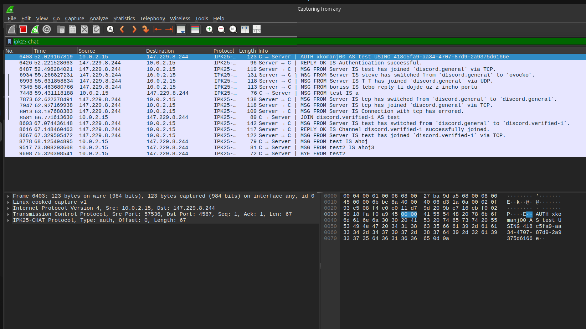
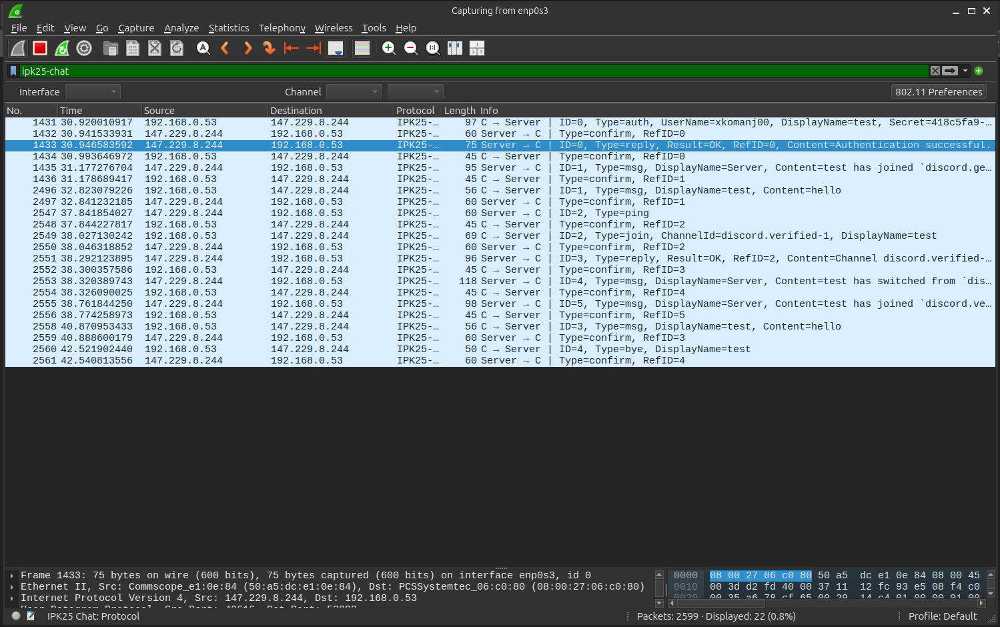

# Project 2 
**Author**: xkomanj00 (xkomanj00@vutbr.cz)

**Repository** https://git.fit.vutbr.cz/xkomanj00/project2

## Content

## Content

1. [Introduction](#introduction)  
2. [Theory](#theory)  
   &nbsp;&nbsp;2.1 [TCP Message Protocol](#tcp-message-protocol)  
   &nbsp;&nbsp;2.2 [UDP Message Protocol](#udp-message-protocol)  
3. [ABNF (Augmented Backus–Naur Form)](#abnf-augmented-backusnaur-form)  
4. [Code Implementation](#code-implementation)  
   &nbsp;&nbsp;4.1 [TcmMessageClient.cs](#tcmmessageclientcs)  
   &nbsp;&nbsp;&nbsp;&nbsp;4.1.1 [ProcessUserInput](#processuserinput)  
   &nbsp;&nbsp;&nbsp;&nbsp;4.1.2 [Sending Messages](#sending-messages)  
   &nbsp;&nbsp;4.2 [TcpMessage.cs](#tcpmessagecs)  
   &nbsp;&nbsp;4.3 [UdpMessageClient.cs](#udpmessageclientcs)  
   &nbsp;&nbsp;&nbsp;&nbsp;4.3.1 [SendUdpMessage](#sendudpmessage)  
   &nbsp;&nbsp;&nbsp;&nbsp;&nbsp;&nbsp;4.3.1.1 [Message Sending](#message-sending)  
   &nbsp;&nbsp;&nbsp;&nbsp;&nbsp;&nbsp;4.3.1.2 [Retransmission & Confirmation](#retransmission--confirmation)  
   &nbsp;&nbsp;&nbsp;&nbsp;&nbsp;&nbsp;4.3.1.3 [Deserialize](#deserialize)  
   &nbsp;&nbsp;4.4 [UdpMessage.cs](#udpmessagecs)  
   &nbsp;&nbsp;4.5 [MessageBuffer.cs](#messagebuffercs)  
5. [Testing](#testing)  
   &nbsp;&nbsp;5.1 [TCP Testing](#tcp-testing)  
   &nbsp;&nbsp;&nbsp;&nbsp;5.1.1 [Discord Server Testing](#discord-server-testing)  
   &nbsp;&nbsp;&nbsp;&nbsp;5.1.2 [Localhost Testing](#localhost-testing)  
   &nbsp;&nbsp;5.2 [UDP Testing](#udp-testing)  
   &nbsp;&nbsp;&nbsp;&nbsp;5.2.1 [Discord Server Testing](#discord-server-testing-1)  
   &nbsp;&nbsp;&nbsp;&nbsp;5.2.2 [Localhost Testing](#localhost-testing-1)  
   &nbsp;&nbsp;5.3 [Additional Testing](#additional-testing)  
6. [Bibliography](#bibliography)


## Introduction

This project implements a chat client that supports two different network protocols:

- **TCP**: A text-based, connection-oriented protocol that ensures reliable, ordered delivery of messages.
- **UDP**: A binary-based, connectionless protocol focused on speed and efficiency, without guaranteeing reliability or order.

> _Note: This documentation was formatted using a large language model (LLM) with the prompt:_  
> **"Format this text so it is readable and follows proper markdown standards."**

## Theory
### TCP Message Protocol

TCP is a text-based protocol that provides **reliable**, **ordered**, and **error-checked** delivery of data between applications over a network.

It is a **connection-oriented** protocol, meaning a connection must first be established using agreed parameters before data can be exchanged. This is achieved through a **three-way handshake** between the client and server.

TCP ensures that Data is delivered in the correct order and that lost or corrupted packets are retransmitted

TCP prioritizes **reliability** over **speed**.

### UDP Message Protocol

UDP is a **binary-based** transport protocol that, unlike TCP, does **not guarantee reliability, ordering, or error correction**. It operates without establishing a prior communication channel, making it a **connectionless protocol**.

Messages (datagrams) are sent independently, with **no negotiation, session tracking, or built-in retransmission**. UDP does not retain any state about what has been sent or received.

Because of this, **messages may arrive out of order, be duplicated, or be lost entirely**. It is the responsibility of the receiving application to **evaluate incoming messages, detect duplicates, ensure correct ordering, and confirm receipt if needed**.

UDP prioritizes **efficiency and speed**.

# ABNF (Augmented Backus–Naur Form)

ABNF is a **metalanguage** used to describe the grammar of formal languages. It is based on Backus-Naur Form (BNF) but adds features such as **case-insensitive rule names, value ranges, repetition, and alternatives**.

It is widely used in **internet protocol specifications**.

In this project, ABNF was used to formally define the structure of **TCP protocol messages**.

## Code Implementation

### TcmMessageClient.cs

The client is implemented using `TcpClient` from `System.Net.Sockets`, which manages establishing the connection to the server using the **three way handshake**. Two background tasks handle message sending and receiving, while the main thread processes user input.

```c#
    _tcpClient = new TcpClient(AddressFamily.InterNetwork);
    _tcpClient.Connect(server, port);
    _state = ClientState.start;

    var stream = _tcpClient.GetStream();
    _reader = new StreamReader(stream);
    _writer = new StreamWriter(stream) { AutoFlush = true };

    _ = Task.Run(ReceiveMessagesAsync, _token);
    _ = Task.Run(SendBufferedMessagesAsync, _token);
    ProcessUserInput();
```

#### ProcessUserInput
The method `ProcessUserInput` reads user commands from the console and parses them. Valid commands are converted into `TcpMessage` objects and added to `_messageBuffer`. Invalid commands are rejected with a local error and not added to the buffer.

```c#
    string? input = Console.ReadLine();
    // the input is checkded
    ...
    var parts = input.Trim().Split(' ', StringSplitOptions.RemoveEmptyEntries);
    var command = parts[0].ToLower();
    var args = parts.Skip(1).ToArray();
    switch (command)
    {
        case "/auth":
            _messageBuffer.Add(new TcpMessage
            {
                Type = TcpMessageType.AUTH,
                MessageArgs = args
            });
            break;
        // other cases
        ...
    }
```

#### Sending Messages
`SendBufferedMessagesAsync` checks for messages in `_messageBuffer`. If sending is allowed (e.g., not waiting for a reply), it validates and sends the message.

```c#
    // checks if any messages are in the buffer
    if (_messageBuffer.IsEmpty)
    {
        await Task.Delay(100);
        continue;
    }

    var message = _messageBuffer.Peek();
    string error;

    // checks if is allowed to send messages and isn't waiting for a reply
    bool allowedToSend = message.Type switch
    {
        TcpMessageType.MSG => !WaitingForAuthReply && !WaitingForJoinReply,
        _ => true
    };

    if (!allowedToSend)
    {
        await Task.Delay(50, _token);
        continue;
    }

    try
    {
        switch (message.Type)
        {  
            case TcpMessageType.AUTH:
            // Argument validation and message sending
            break;
        // handle other types
        ...
        }
    }
```

### TcpMessage.cs
`TcpMessage` defines the structure and serialization logic of TCP messages stored in the message buffer. When the `Serialize()` function is called, the message type and its arguments are validated. If no errors are found, the message is returned as a properly formatted string.

```c#
public class TcpMessage : Message
{
    public TcpMessageType Type { get; set; }
    public string Content { get; set; } = string.Empty;
    public string[] MessageArgs { get; set; } = Array.Empty<string>();
    public string DisplayName { get; set; } = "Unknown";
    public string Secret { get; set; } = string.Empty;
    private static readonly Regex ChannelIdRegex = new(@"^[a-zA-Z0-9_-]{1,20}$");

    public string Serialize(out string error)
    {
        error = string.Empty;

        switch (Type)
        {
            case TcpMessageType.AUTH:
                if (MessageArgs.Length != 3)
                {
                    error = "ERROR: Usage: /auth <username> <secret> <displayName>";
                    return string.Empty;
                }

                return $"AUTH {MessageArgs[0]} AS {MessageArgs[2]} USING {MessageArgs[1]}\r\n";
            // Handle other cases
            ...
        }
    }
    ...
}
```

### UdpMessageClient.cs

The `UdpMessageClient` handles communication over the **UDP protocol** using the `UdpClient` class from `System.Net.Sockets`. Since Udp does not guarantee message delivery, order, or integrity so **retransmissions**, **message confirmation**, and **duplicate detection** has to be implemented in the client.

Exactly like in the tcp client once the client starts, two background tasks are launched:
- `ReceiveMessagesAsync()` listens for incoming UDP packets.
- `SendBufferedMessagesAsync()` handles outgoing messages from a local buffer.

```c#
    _udpClient = new UdpClient(new IPEndPoint(IPAddress.Any, 0));
    _remoteEndpoint = new IPEndPoint(ipAddress, port);

    _token = _cts.Token;

    _ = Task.Run(ReceiveMessagesAsync, _token);
    _ = Task.Run(SendBufferedMessagesAsync, _token);
    ProcessUserInput();
```

#### SendUdpMessage

##### Message sending
Handles the **serialization** and **confirmation of delivery** of UDP messages.  
The message is first serialized into a byte array, and then sent to the server.

```c#
   _pendingConfirmationId = _currentMessageId;

string error;
var packet = message.Serialize(out error, _currentMessageId);
if (!string.IsNullOrEmpty(error))
{
    Console.WriteLine(error);
    _messageBuffer.TryGet(out _);
    return false;
}
```

##### Retransmission & Confirmation
After sending, the client waits for a confirmation (`CONFIRM` packet) from the server.
If no confirmation is received within the timeout period, the message is retransmitted, up to `maxUdpRetransmissions` times.
If all attempts fail, the client terminates with an error.

```c#
int retransmissionCount = 0;
bool confirmed = false;

while (retransmissionCount <= _maxUdpRetransmissions && !confirmed)
{
    await _udpClient!.SendAsync(packet, packet.Length, _remoteEndpoint);

    var confirmationTask = Task.Run(async () =>
    {
        while (_pendingConfirmationId == _currentMessageId)
        {
            await Task.Delay(10); // Prevent CPU hogging
        }
        return _pendingConfirmationId == -1;
    });

    if (await Task.WhenAny(confirmationTask, Task.Delay(_udpConfirmationTimeout)) == confirmationTask)
    {
        confirmed = await confirmationTask;
        break;
    }

    retransmissionCount++;
}

if (!confirmed && retransmissionCount > _maxUdpRetransmissions)
{
    Console.WriteLine(
        $"ERROR: UDP message {_currentMessageId} failed after {_maxUdpRetransmissions} retransmission attempts");
    _pendingConfirmationId = -1;
    _currentMessageId++;
    EndCommunication(1);
    return false;
}

_currentMessageId++;
return true;
```
#### Deserialize

Deserialization of recieved messages is done using a Binary reader that extracts the fields into a null terminated utf8 string.

```c#
public Dictionary<string, object> Deserialize(byte[] data)
{
    using var ms = new MemoryStream(data);
    using var reader = new BinaryReader(ms);

    byte typeByte = reader.ReadByte();
    ushort messageId = 0;
    Dictionary<string, object> result = new()
    {
        ["Type"] = (UdpMessageType)typeByte
    };
    logger.LogInformation($"type: {(UdpMessageType)typeByte}");
    switch ((UdpMessageType)typeByte)
    {
        case UdpMessageType.CONFIRM:
            result["RefMessageID"] = ReadUInt16(reader);
            break;
            // other cases
            ...
    }
}
```

### UdpMessage.cs

`UdpMessage` defines the structure and serialization logic for UDP Messages stored in the message Buffer. 
When the `Serialize()` function is called it validates the input and dispatches to a message-specific creator function based on the message type. Each message is assigned a unique `messageId` and encoded as a byte array in UTF-8 with null-terminated strings.

```c#

    public UdpMessageType Type { get; set; }
    public string DisplayName { get; set; } = "Unknown";
    public byte[] Content { get; set; } = [];
    public string[] MessageArgs { get; set; } = Array.Empty<string>();

    public byte[] Serialize(out string error, ushort messageId)
    {
        error = string.Empty;

        switch (Type)
        {
            case UdpMessageType.AUTH:
                return CreateAuthMessage(messageId, MessageArgs[0], MessageArgs[2], MessageArgs[1]);
            // Handle other cases
            ...
        }
    }
    ...
```

### MessageBuffer.cs
A generic buffer class using `Queue<T>` to store and manage messages.

```c#
public class MessageBuffer<T> : IMessageBuffer<T> where T : Message
{
    private readonly Queue<T> _buffer = new();

    public void Add(T message)
    {
        _buffer.Enqueue(message);
    }

    public bool TryGet(out T? message)
    {
        return _buffer.TryDequeue(out message);
    }

    public T? Peek() => _buffer.TryPeek(out var result) ? result : null;

    public bool IsEmpty => _buffer.Count == 0;
}
```
## Testing

---

### TCP Testing

#### Discord Server Testing

For real world testing, the Discord server provided by Ing. Dolejška was used.  
It allowed us to verify the functionality of the TCP client against an actual deployed server and inspect real-time communication behavior.

Wireshark was used to capture traffic, and command-line interaction demonstrated full authentication, message sending, joining channels, and disconnecting.

Below is the captured test session using the official Discord server:

Wireshark output:  


Client input:
```
./ipkchat-scan -s anton5.fit.vutbr.cz -t tcp
/auth xkomanj00 **secret** test
a
/join discord.verified-1
ahoj
/rename test2
ahoj3
(ctrl+c)
```

---

#### Localhost Testing

Testing of states that weren't covered in Discord server testing.

The command was used to simulate a TCP server locally:
```bash
nc -4 -C -l -v 127.0.0.1 4567
```

##### TESTING SEND BYE
This was tested and done for each state except join

**server:**
```bash
nc -4 -C -l -v 127.0.0.1 4567
BYE FROM SERVER
```

**client:**
```
./ipk25chat-client -s localhost -t tcp
BYE FROM SERVER
```

##### Receiving !REPLY in auth state

**server:**
```
AUTH a AS c USING b
REPLY NOK IS invalid user
AUTH vale AS g USING f
REPLY OK IS valid ser
BYE FROM g
```

**client:**
```
./ipk25chat-client -s localhost -t tcp
/auth a b c
Action Failure: invalid user
/auth e f g
Action Success: valid ser
```

##### Sending messages while waiting for auth or join

**server:**
```
nc -4 -C -l -v 127.0.0.1 4567
Listening on localhost 4567
Connection received on localhost 59054
AUTH a AS c USING b
REPLY OK IS valid user
MSG FROM c IS msg1
MSG FROM c IS msg2
MSG FROM c IS msg3
JOIN channel1 AS c
REPLY OK IS switched channel
MSG FROM c IS msg4
MSG FROM c IS msg5
MSG FROM c IS msg6
BYE FROM c
```

**client:**
```
./ipk25chat-client -s localhost -t tcp
/auth a b c
msg1
msg2
msg3
Action Success: valid user
/join channel1
msg4
msg5
msg6
Action Success: switched channel
```

##### Sending a message if auth receives NOK

**server:**
```
nc -4 -C -l -v 127.0.0.1 4567
Listening on localhost 4567
Connection received on localhost 59338
AUTH a AS c USING b
REPLY NOK IS invalid user
BYE FROM c
```

**client:**
```
./ipk25chat-client -s localhost -t tcp
/auth a b c
Action Failure: invalid user
a
ERROR: You must be authenticated before sending messages.
```

##### Receiving REPLY OK or NOK in state OPEN

**server:**
```
nc -4 -C -l -v 127.0.0.1 4567
Listening on localhost 4567
Connection received on localhost 60922
AUTH a AS c USING b
REPLY OK IS valid user
REPLY OK IS random reply OK
ERR FROM c IS Malformed message received from server.
```

**client:**
```
./ipk25chat-client -s localhost -t tcp
/auth a b c
Action Success: valid user
ERROR: Malformed message received from server
```

**server:**
```
nc -4 -C -l -v 127.0.0.1 4567
Listening on localhost 4567
Connection received on localhost 34250
AUTH a AS c USING b
REPLY OK IS valid user
REPLY NOK IS random Nok
ERR FROM c IS Malformed message received from server.
```

**client:**
```
./ipk25chat-client -s localhost -t tcp
/auth a b c
Action Success: valid user
ERROR: Malformed message received from server
```

The reply NOK or OK is understood as a malformed message since it is an invalid type of message received in that state.

##### Invalid response from server

What was tested next:
Multiple user auth

```
./ipk-chat -s -tcp
(press ctrl+c)
/ serer
```

GETTING ERR, BYE
This was tested in all states  
Example:
```
./ipk-chat -s -tcp
ERROR FROM server IS An error has occured
BYE FROM server
```

Example:
```
/TESTING AUTH
/auth a b c
msg1
ERROR: can't send message here
```

**server:**
```
REPLY IS nOK invaid login
```

### UDP Testing

#### Discord Server Testing

For real world testing, the Discord server provided by Ing. Dolejška was used.  
This allowed us to observe how the UDP client handled real-time communication over an actual network, including serialization of messages, message loss, and retransmissions.

Wireshark was used to capture traffic, and command-line input was used to test authentication, channel joining, and message delivery.

Wireshark output:  


**client:**
```
./ipkchat-scan -s anton5.fit.vutbr.cz -t udp
/auth xkomanj00 **secret** test
hello
/join discord.verified-1
hello
(ctrl+c)
```

#### Localhost Testing

This testing was done using a student-created UDP server available at:  
https://github.com/okurka12/ipk_proj1_livestream/tree/main

To start the server:
```bash
python3 ipk_server.py
```

##### TESTING: Basic auth + msg + bye

**client:**
```
/auth a b c    
Action Success: Hi, c, this is a successful REPLY message to your AUTH message id=0. You wanted to authenticate under the username a
msg
Server: Hi, c! This is a reply MSG to your MSG id=1 content='msg...' :)
```
**server:**
```
python3 ipk_server.py 
started server on 0.0.0.0 port 4567

Message from 127.0.0.1:52249 came to port 4567:
TYPE: AUTH
ID: 0
USERNAME: 'a'
DISPLAY NAME: 'c'
SECRET: 'b'
b'\x02\x00\x00a\x00c\x00b\x00'
Confirming AUTH message id=0
sending REPLY with result=1 to AUTH msg id=0

Message from 127.0.0.1:52249 came to port dyn2:
TYPE: MSG
ID: 1
DISPLAY NAME: 'c'
'msg'
b'\x04\x00\x01c\x00msg\x00'
Confirming MSG message id=1

Message from 127.0.0.1:52249 came to port dyn2:
TYPE: BYE
ID: 2
b'\xff\x00\x02c\x00'
Confirming BYE message id=2
```

##### TESTING: Full lifecycle (auth + join + msg + bye)

**client:**
```
./ipk25chat-client -s localhost -t udp 
/auth a b c
Action Success: Hi, c, this is a successful REPLY message to your AUTH message id=0. You wanted to authenticate under the username a
/join channel1
Action Success: Hi, c, this is a successful REPLY message to your JOIN message id=1. You wanted to join the channel channel1
[21:39:42] info: project2.Models.UdpMessageClient[0] sending confirmation
hi
Server: Hi, c! This is a reply MSG to your MSG id=2 content='hi...' :)
/rename z
hi again
Server: Hi, z! This is a reply MSG to your MSG id=3 content='hi again...' :)
```
**server**
```
python3 ipk_server.py 
started server on 0.0.0.0 port 4567

Message from 127.0.0.1:50009 came to port 4567:
TYPE: AUTH
ID: 0
USERNAME: 'a'
DISPLAY NAME: 'c'
SECRET: 'b'
b'\x02\x00\x00a\x00c\x00b\x00'
Confirming AUTH message id=0
sending REPLY with result=1 to AUTH msg id=0

Message from 127.0.0.1:50009 came to port dyn2:
TYPE: JOIN
ID: 1
DISPLAY NAME: 'c'
CHANNEL ID: 'channel1'
b'\x03\x00\x01channel1\x00c\x00'
Confirming JOIN message id=1
sending REPLY with result=1 to JOIN msg id=1

Message from 127.0.0.1:50009 came to port dyn2:
TYPE: MSG
ID: 2
DISPLAY NAME: 'c'
'hi'
b'\x04\x00\x02c\x00hi\x00'
Confirming MSG message id=2

Message from 127.0.0.1:50009 came to port dyn2:
TYPE: MSG
ID: 3
DISPLAY NAME: 'z'
'hi again'
b'\x04\x00\x03z\x00hi again\x00'
Confirming MSG message id=3

Message from 127.0.0.1:50009 came to port dyn2:
TYPE: BYE
ID: 4
b'\xff\x00\x04z\x00'
Confirming BYE message id=4
```


### Additional Testing

Additional testing was also performed using student-created tests to help catch edge cases and unusual behaviors. They weren't the only tests used, but forgoing tests that provide valuable edge cases or highlight potential problems I might have missed during development would have been in my opinion not the best idea.

You can find the test repository here:  
[https://github.com/Vlad6422/VUT_IPK_CLIENT_TESTS](https://github.com/Vlad6422/VUT_IPK_CLIENT_TESTS) 

## Bibliography

- [RFC5234] Crocker, D. and Overell, P. Augmented BNF for Syntax Specifications: ABNF [online]. January 2008. [cited 2025-04-20]. DOI: 10.17487/RFC5234. Available at: https://datatracker.ietf.org/doc/html/rfc5234  

- [RFC768] Postel, J. User Datagram Protocol [online]. March 1997. [cited 2025-04-20]. DOI: 10.17487/RFC0768. Available at: https://datatracker.ietf.org/doc/html/rfc768  

- Wikipedia contributors. Augmented Backus–Naur Form [online]. Wikipedia, The Free Encyclopedia. [cited 2025-04-20]. Available at: https://en.wikipedia.org/wiki/Augmented_Backus%E2%80%93Naur_form

- [RFC9293] Eddy, W. Transmission Control Protocol (TCP) [online]. August 2022. [cited 2025-04-20]. DOI: 10.17487/RFC9293. Available at: https://datatracker.ietf.org/doc/html/rfc9293  

- Microsoft. System.Net.Sockets.TcpClient Class [online]. [cited 2025-04-20]. Available at: https://learn.microsoft.com/en-us/dotnet/api/system.net.sockets.tcpclient?view=net-9.0  

- Microsoft. System.Net.Sockets.UdpClient Class [online]. [cited 2025-04-20]. Available at: https://learn.microsoft.com/en-us/dotnet/api/system.net.sockets.udpclient?view=net-9.0  

- Vladislav Koman, "VUT IPK Client Tests" [online]. GitHub Repository. [cited 2025-04-20]. Available at: https://github.com/Vlad6422/VUT_IPK_CLIENT_TESTS  

- Ondřej Kurka, "UDP Test Server for IPK Project 1" [online]. GitHub Repository. [cited 2025-04-20]. Available at: https://github.com/okurka12/ipk_proj1_livestream/blob/main/README.md  

- OpenAI ChatGPT. Used as a development aid during implementation, particularly for asynchronous programming and cancellation tokens.  

- OpenAI. ChatGPT. Used during the project for formatting assistance, improving Markdown readability, and organizing documentation structure. [cited 2025-04-20]. Available at: https://openai.com/chatgpt

- Project 1 (Argument Parser). Concepts and structure reused for command-line parsing logic.

